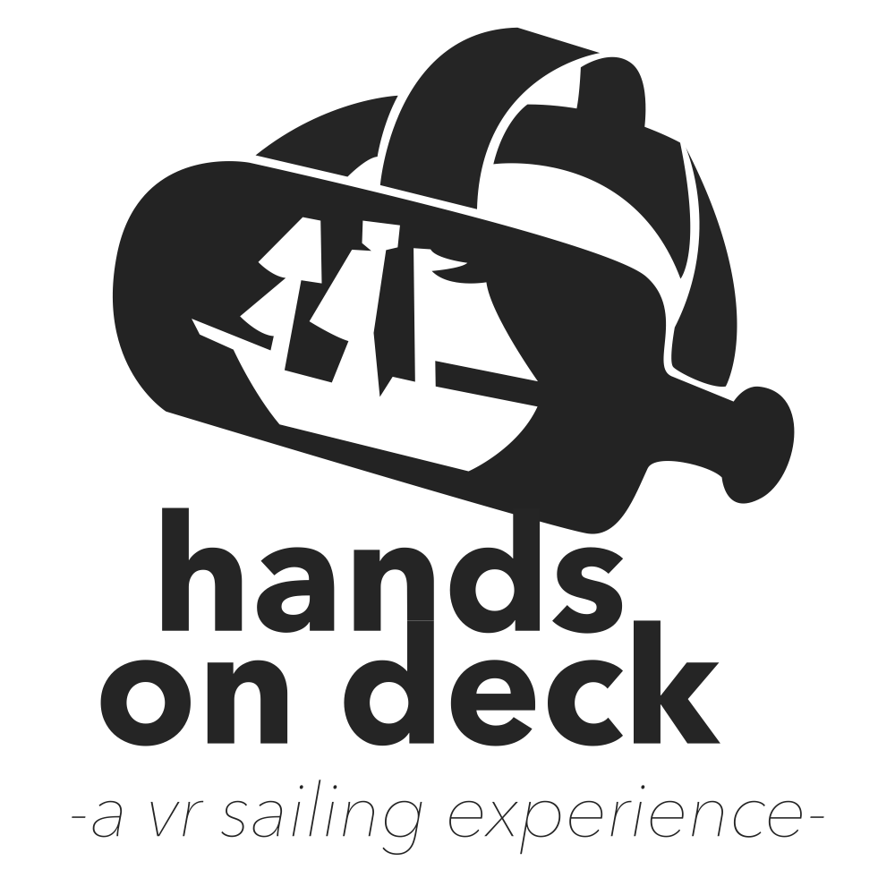

<a href="https://uwrealitylab.github.io/vrcapstone20sp-team6/">Project Website</a>

Hands on Deck is a VR sailing experience designed for the Oculus Quest as part of the VR Capstone at the University of Washington.
For information on how to build our project to run on your own Oculus Quest, please see README - Build Instructions.

Made by James Morren, Patrick Mao, Abhinav Singh, and Julian Gallegos

